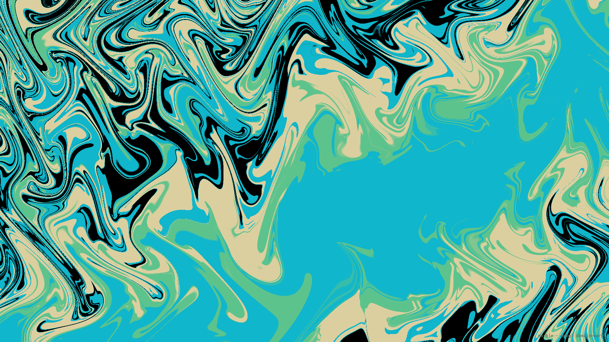

# marble

A WebGL domain-warp background effect, derived from studying the main-menu
shader of *Bomb Rush Cyberfunk* (Team Reptile).

[Live demo](https://arsentsn.github.io/brc-background/)

Clone and open `index.html` in a browser; it runs from `file://`. The page also
loads `views/` for the reconstructed menu screens, with art and typefaces from
`assets/`; without those it runs on a flat-colour fallback.

How it was made: [OVERVIEW.md](OVERVIEW.md) is the readable tour,
[docs/TOOLING.md](docs/TOOLING.md) has the capture and verification recipes,
and [docs/SCREENS.md](docs/SCREENS.md) documents the reconstructed menu screens.



## Controls

The panel covers zoom, palette offset, warp iterations, warp width, banding,
field scale, and morph speed — each with tooltips explaining what it does.
The presets are the game's two material schemes, three of this project's own,
and whatever you save in this browser. A preset is a look only — the HUD
row is what puts the reconstructed screens up. Editing any preset forks a
working copy you can name and keep, or discard by picking another preset. Double-clicking a
slider reverts just that control; picking a preset again reverts everything.

The window docks to the top edge, slides out of it, and can be dragged anywhere
by its header once docked. On portrait phones it becomes a bottom sheet instead,
with the marble running full-bleed behind it.

Keys: `←`/`→` step the phase (`shift` for coarse), `space` play/pause, `1`–`9`
pick presets, `h` panel, `f` fullscreen.

Settings persist in `localStorage`, except when the URL pins any render
parameter, in which case the URL wins and storage is untouched. That keeps the
reproducible URLs below reproducible:

```
index.html?preset=indigo&t=0.744&scale=1&iter=18&speed=0.0122&amp=534.5&mix=0.358&s6=1.9&flow=0&ui=0
```

`t` freezes the animation at a fixed clock value, so the same URL always renders
the same frame. **copy link** writes this whole form back out from whatever is on
screen, and `ui=0` hides all UI for wallpapers, embeds, and headless screenshots:

```sh
chrome --headless=new --window-size=1600,900 --virtual-time-budget=3000 \
  --screenshot=out.png "file://$PWD/index.html?ui=0&t=0.744&preset=ember"
```

## React

A React port lives in [`react/`](react/README.md): one component in TypeScript or
JavaScript, shadcn registry items, and a demo.

```jsx
<Marble colors={['#ffcf87', '#ff7a5c', '#b02d6e', '#150a12', '#ff9448']} speed={0.01} />
```

## Provenance

**Read [PROVENANCE.md](PROVENANCE.md)**. It states what is original here, what is
not, and what is deliberately absent. No game assets, captures, or shader dumps
are included in this repository. Not affiliated with or endorsed by Team Reptile.

## Licence

MIT for the original code here; see [LICENSE](LICENSE).
